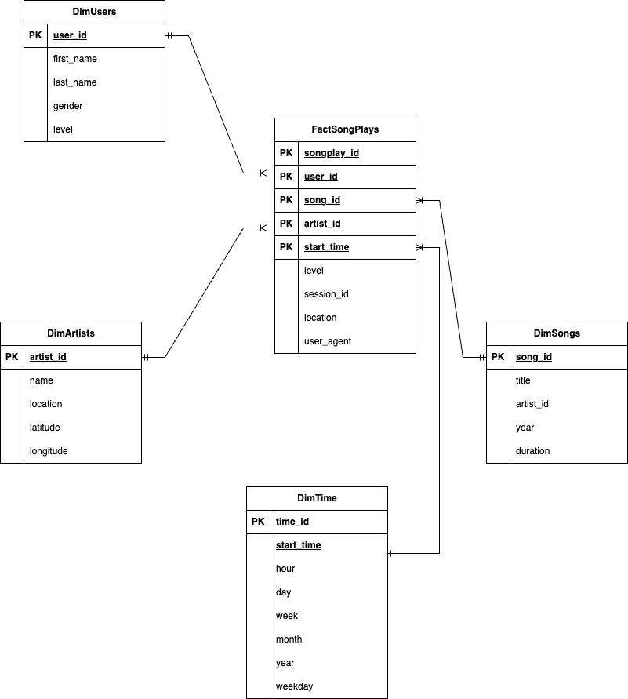

# sparkify_song_lib_analytics
Sparkify Cloud Migration &amp; Data Warehouse Project

TASK

Sparkify, a burgeoning music streaming startup, has witnessed significant expansion in both their user community and song catalog. Eager to enhance their processes and leverage the advantages of cloud technology, they've decided to migrate their data onto the cloud. Currently, their data is stored in Amazon S3, encompassing JSON logs detailing user activity within the app and a separate directory containing JSON metadata related to the songs in their expansive library.

As the appointed data engineer for Sparkify, I have constructed a business-oriented Data Model and an Extract, Transform, Load (ETL) pipeline. This pipeline loads data from S3 buckets into a couple of staging tables in Amazon Redshift. The data is then loaded into defined Fact and Dimension tables after undergoing some transformations. This setup is aimed at providing the analytics team at Sparkify with a robust framework to extract valuable insights regarding the user beaviour and engaement on the platform. 

DATAWAREHOUSE DESIGN 
In the process of designing our data warehouse, we prioritize efficient data distribution and maintain consistency in our dimensional and fact tables.

I join songs with song play events based on the song name as the best matching field.

To uniquely identify each song play in the FactSongPlay table we have a Clustered primary key consisting of the various primary keys in the dimension tables user_id, song_id, artist_id with the exception of time_id (I opted to join the DimTime on start_time instead as you would later see).

When populating the FactSongPlays table, I enforce certain conditions for data integrity. Only song play events with a page value of 'NextSong' page are considered for insertion.

The 'song_id' field, which corresponds to the 'song_id' PRIMARY KEY in the Dimension Songs is chosen as a dsitribution key to optimize queries involving JOINS to the Songs Dimension which are expected to be relatively frequent.

Below are my considerations for my dimensional tables:

DimensionUsers:
Primary key: Unique user IDs.
I filter for null user IDs during insertion to maintain non-null constraints as a user can not be identified without an id.
Since there are duplicate users as a result of users with updated subscription levels (e.g from free tier to paid), I query to select the most recent subscription level based on their timestamp.
I leave the sorting strategy to redhsift which does this based on the frequency of certain queries.
Distribution style: ALL, as this small table is frequently used in joins, and the storage cost of replicating keys across nodes is negligible.

DimensionSongs:
Primary key: Unique song IDs.
I filter for null song IDs during insertion to maintain non-null constraints.
Song ID is set as a distribution key to optimize query performance for song-related information. This choice enhances filtering operations by reducing the data scanned across nodes.
I select song_id (which is unique) as the dist key to ensure the load is distributed evenly across partitions, thus improving query performance. 
I leave the sorting strategy to redhsift which does this based on the frequency of certain queries.
Avoid using ALL distribution due to the large size of the table as this would result in high storage costs.

DimArtist:
Primary key: Unique artist IDs.
I filter for null artist IDs during insertion to maintain non-null constraints as an artist can not be identified without an id.
I leave the sorting strategy to redhsift which does this based on the frequency of certain queries.
Distribution style: ALL, as this relatively table is frequently used in joins, and the storage cost of replicating keys across nodes is negligible.

DimTime:
Convert epoch time to timestamp for better usability.
Introduce an auto-incrementing integer as primary key as it is a concern that the TIMESTAMP values might not be precise enough to guarantee uniqueness for each row in your table
Distribution style: ALL, as this relatively table is frequently used in joins, and the storage cost of replicating keys across nodes is negligible.

ETL Pipeline
My ETL pipeline copies data from Amazon S3 into Amazon Redshift involving several steps to ensure the efficient extraction, transformation, and loading of data for analytical queries. Here's an overview of the process:

1. Extraction:
Source Data is a couple of files containing song data and log files containing simulated song play events in JSON format stored in S3

Staging tables that mirror the structure of the source data are created in Amazon Redshift . These staging tables will temporarily hold the data during the extraction process.

AWS COPY Command:

The Redshift COPY command is used to efficiently load data from S3 into the staging tables. This step ensures that the raw data is readily available within the Redshift environment.

2. Transformation:
Data Cleaning and Enrichment:

I apply transformations to clean and enrich the data as needed. This include handling missing values, converting data types.

Timestamp Conversion:

The source data includes timestamps in a different format (epoch time), I convert them to a standard timestamp format for consistency and ease of analysis.

Joining Tables:

Multiple source tables need to be joined for analysis. I perform the necessary joins during this stage to create a consolidated dataset.

Applying Business Logic:

I implement the business logic required for the analytics queries.

3. Loading:
Fact and Dimensional Tables:

I create the Fact and Dimensional tables where the transformed data will be loaded. I also ensure that these tables have the appropriate structure to support analytical queries.

Insert Data:

I insert the transformed data from the staging tables into the respective Fact and Dimensional tables. I use SQL INSERT statements for this purpose.

Data Integrity Checks:

I implement data integrity checks to ensure that the loaded data meets the expected criteria and constraints, such as primary key uniqueness in dimensional tables.

4. Analytics Readiness:
Indexes and Sort Keys:

I have defined indexes and sort keys on the fact and dimensional tables based on anticipated query patterns. This helps optimize query performance.

Distribution Keys:

I implement a distribution strategy to help the query planner in making optimal execution plans. I choose appropriate distribution keys for fact and dimensional tables.

Query Optimization:

I test and optimize queries for performance based on the distribution and structure of the data.

Potential Business Questions and Analytics Queries
- Find Most Popular Songs

SELECT ds."song_id", ds."title", da."artist_name", COUNT(fs."songplay_id") AS play_count
FROM fact_songplay fs
JOIN dim_songs ds ON fs."song_id" = ds."song_id"
JOIN dim_artists da ON ds."artist_id" = da."artist_id"
GROUP BY ds."song_id", ds."title", da."artist_name"
ORDER BY play_count DESC

- Identify Users' Listening Patterns
SELECT du."user_id", du."firstName", du."lastName", COUNT(fs."songplay_id") AS play_count
FROM dim_users du
JOIN fact_songplay fs ON du."user_id" = fs."user_id"
GROUP BY du."user_id", du."firstName", du."lastName"
ORDER BY play_count DESC

- Identify Geographic Listening Patterns
SELECT da."artist_location", COUNT(fs."songplay_id") AS play_count
FROM dim_artists da
JOIN dim_songs ds ON da."artist_id" = ds."artist_id"
JOIN fact_songplay fs ON ds."song_id" = fs."song_id"
GROUP BY da."artist_location"
ORDER BY play_count DESC

